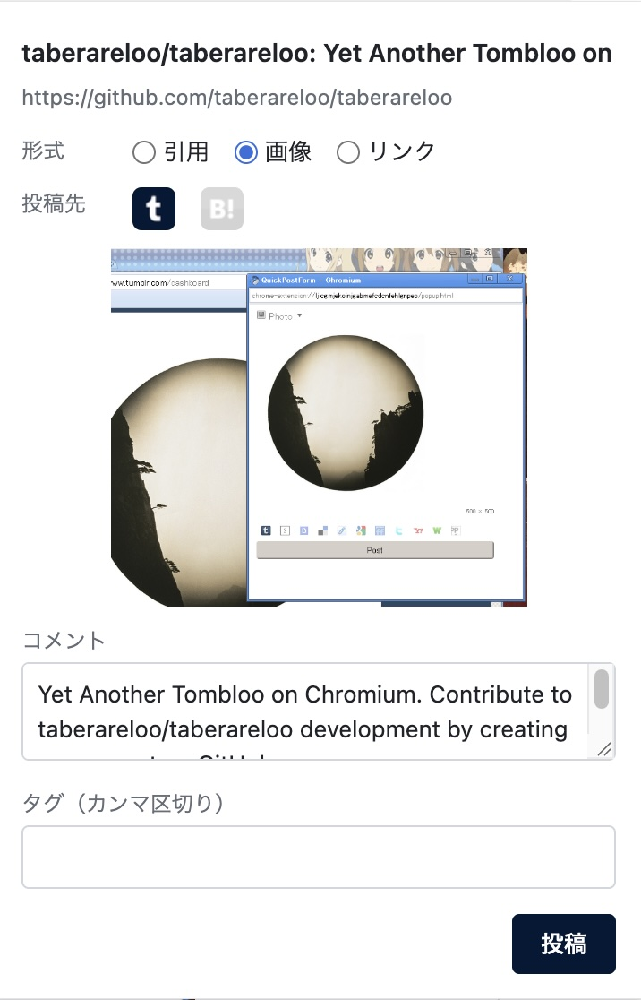

# Tabemakuloo

[](https://github.com/dlwr/tabemakuloo)

## DESCRIPTION

Yet Another Taberareloo on Chromium.
A spiritual successor of Tombloo and Taberareloo, the Cross Post Support Tool for social bookmarks and other services, rebuilt with TypeScript and Manifest V3.

Services:

+  Tumblr (quote / photo / link / reblog)
+  HatenaBookmark (a Japanese popular social bookmarking service)
+  X (quote / link)

## USAGE

+ Right click on a selection, an image, a page or a Tumblr post
  + `Quick - ...` posts to the default services at once and tells the result by notifications
  + `Form - ...` opens the form to check and edit the post before posting
+ Click the toolbar button to open the form
+ Choose the default services for each post type on the options page

## FEATURES/PROBLEMS

+ post to a lot of services at once
+ uses your logged in sessions, so no API keys are needed
+ photos are downloaded and uploaded, so hotlink protected images can be posted
+ posts to X by opening its compose page in a background tab and pressing the post button

## DEPENDENCIES

+ Google Chrome or Chromium
+ Node.js (to build)

## INSTALL

Not published on the Chrome Web Store yet.

```sh
npm install
npm run build
```

Open `chrome://extensions`, turn on Developer mode, and load `dist` with "Load unpacked".

## SCREENSHOT



## DEVELOPERS

+ dlwr

Standing on the shoulders of Taberareloo Dev Team and Tombloo Dev Team.

## LICENSE

Tabemakuloo Code
(The MIT License)
Copyright (c) dlwr

Service icons belong to their respective owners.
